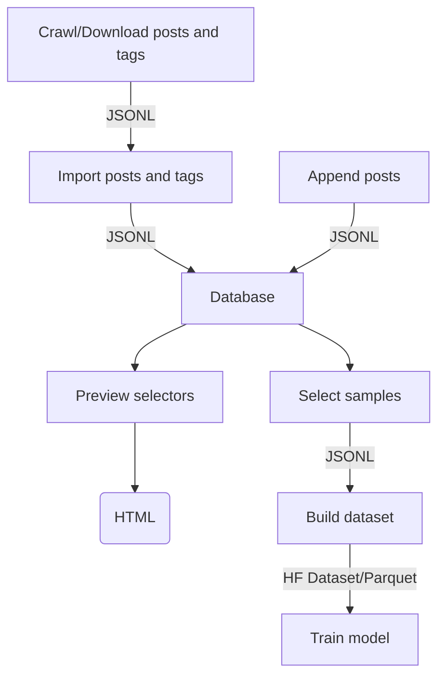

# E621 Rising

> Toolchain for training Stable Diffusion 1.x, Stable Diffusion 2.x, and Stable Diffusion XL models
> on custom image datasets.

* Crawl and download metadata from E621 and other image boards
* Combine multiple sources of images, including your own custom ones
* Build datasets based on your personal preferences
* Train Stable Diffusion models on your datasets
* Modular design and JSONL data exchange formats – use only the parts you need
* Known to work with Nvidia's RTX30x0, RTX40x0, A100, and H100 GPUs

## Requirements
* Python 3
* Docker


## Setting Up
Creates a virtual environment, installs packages, and sets up a MongoDB database on Docker. 

```bash
./up.sh
```

## Shutting Down
Stops the MongoDB database container. The database can be restarted by running `./up.sh` again.

```bash
./down.sh
```


## Uninstall
Warning: This step **removes** the MongoDB database container and all data stored on it.

```bash
./uninstall.sh
```


```mermaid


```


## Full Example

### 0. Setup
Make sure you install Docker and Python3 before continuing.

```bash
cd <e621-rising>
./up.sh
```

### 1. Download Metadata
E621 Rising has a crawler to download metadata (=posts and tags) from E621 and other booru-style image boards.

To skip this step, you can download these metadata snapshots from Huggingface: [tags]() [posts]() 

```bash
cd <e621-rising>/crawl

## download tag metadata to /tmp/e621.net-tags.jsonl
python3 crawl.py --output /tmp/e621.net-tags.jsonl --type tags --source e621 --recover

## download posts metadata to /tmp/e621.net-posts.jsonl
python3 crawl.py --output /tmp/e621.net-posts.jsonl --type index --source e621 --recover
```

### 2. Import Metadata
Once you have enough post and tag metadata, it's time to import the data into a database.

E621 Rising uses MongoDB as a store for the post and tag metadata. Use `import` to
import the metadata downloaded in the previous step into MongoDB.

If you want to adjust how the tag metadata is treated during the import,
review files in `<e621-rising>/examples/tag_normalizer` and set the optional
tags `--prefilter FILE`, `--rewrites FILE`, `--aspect-ratios FILE`, `--category-weights FILE`, and
`--symbols FILE` accordingly.

```bash
cd <e621-rising>/database

python3 import.py --tags /tmp/e621.net-tags.jsonl --input /tmp/e621.net-posts.jsonl --source e621
```

### 3. Preview Selectors
After the metadata has been imported into a database, you can use selector files to select
a subset of the posts in a dataset.

Your goal is **not** to include **all** images, but instead to produce
a set of **high quality** samples. The selectors are the mechanism for that.

Note that a great dataset will contain positive **and** negative examples. If you only
train your dataset with positive samples, your model will not be able to use negative
prompts well.

E621 Rising has example selectors available in `<e621-rising>/examples/select`. These
are the selectors used for building [E621 Rising V3](https://huggingface.co/hearmeneigh/e621-rising-v3) SDXL model.

To make sure your selectors are producing the kind of samples you want, use the `preview`
script:

```bash
cd <e621-rising>/database

# generate a HTML preview of how the selector will perform (note: --aggregate is required):
python3 preview.py --selector ./examples/select/curated.yaml --output /tmp/curated-previews --limit 1000 --output --aggregate

# generate a HTML preview of how each sub-selector will perform:
python3 preview.py --selector ./examples/select/positive/artists.yaml --output /tmp/curated-artists
```

### 4. Select Images For a Dataset
When you're ready to build a dataset, use `pick` to select posts from the database and store them in a JSONL file. 

```bash
cd <e621-rising>/database

python3 pick.py --selector ./examples/select/curated.yaml --output /tmp/curated.jsonl
python3 pick.py --selector ./examples/select/negative.yaml --output /tmp/negative.jsonl
python3 pick.py --selector ./examples/select/positive.yaml --output /tmp/positive.jsonl
python3 pick.py --selector ./examples/select/uncurated.yaml --output /tmp/uncurated.jsonl
```

### 5. Build a Dataset
After selecting the posts for the dataset, use `build` to download the images and build the dataset

By default, the build script prunes all tags that have fewer than 150 samples. To adjust this limit, use `--prune LIMIT`.

```bash
cd <e621-rising>/dataset

python3 build.py \
  --source /tmp/curated.jsonl:30% \       # 30% of the dataset will be curated samples
  --source /tmp/positive.jsonl:40% \      # 40% of the dataset will be positive samples
  --source /tmp/negative.jsonl:20% \      # etc.
  --source /tmp/uncurated.jsonl:10% \
  --output /tmp/e621-rising-v3-dataset \
  --upload-to-hf username/dataset-name    # optional
```

### 6. Train a Model

```bash
cd <e621-rising>/train

python3 train.py \
  --dataset username/dataset-name \
  --base-model stabilityai/stable-diffusion-xl-base-1.0 \
  --output /tmp/e621-rising-v3-model \
  --batch-size 1 \  # increase if you have a lot of GPU memory  
  --upload-to-hf username/model-name \  # optional
  --snapshot-to-s3 s3://some-bucket/some/path # optional
```

## Advanced Topics

### Importing Posts from Multiple Sources
The `append` script allows you to import posts from additional sources.

Use `import` to import the first source and define the tag namespace, then use `append` to import additional sources.

```bash
cd <e6261-rising>/database

python3 import.py ...  #  E621 sources

python3 append.py --input /tmp/gelbooru-posts.jsonl --source gelbooru
```


### Architecture


