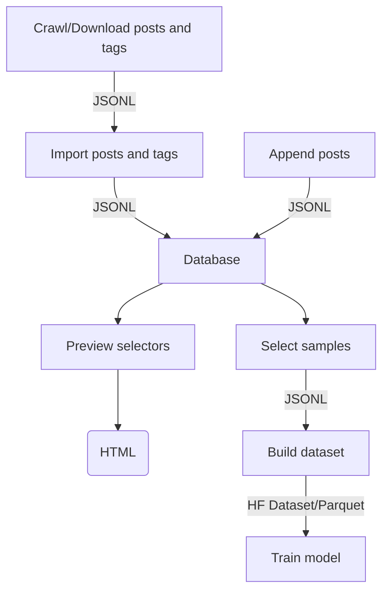

# Dataset Rising

> A toolchain for creating and training Stable Diffusion 1.x, Stable Diffusion 2.x, and Stable Diffusion XL models
> with custom datasets.

With this toolchain, you can:
* **Crawl and download** metadata and images from 'booru' style image boards
* Combine **multiple sources of images** (including your own custom sources)
* **Build datasets** based on your personal preferences and filters
* **Train Stable Diffusion models** with your datasets
* Convert models into [Stable Diffusion WebUI](https://github.com/AUTOMATIC1111/stable-diffusion-webui/tree/master) compatible models
* Use only the parts you need – the toolchain uses modular design, YAML configuration files, and JSONL data exchange formats
* Work with confidence that the end-to-end tooling has been tested with Nvidia's RTX30x0, RTX40x0, A100, and H100 GPUs

## Requirements
* Python `>=3.9.6, <3.11`
* Docker `>=24.0.0`

## Tested With
* MacOS 13 (M1)
* Ubuntu 22 (x86_64)


## Setting Up
Creates a virtual environment, installs packages, and sets up a MongoDB database on Docker. 

```bash
./up.sh
```

## Shutting Down
Stops the MongoDB database container. The database can be restarted by running `./up.sh` again.

```bash
./down.sh
```


## Uninstall
Warning: This step **removes** the MongoDB database container and all data stored on it.

```bash
./uninstall.sh
```


## Full Example
Below is a summary of each step in dataset generation process. For a full production-quality example, see [e621-rising-configs](https://github.com/hearmeneigh/e621-rising-configs) (NSFW).

### 0A. Setup
Make sure you install Docker and Python 3 before continuing.

```bash
cd <dataset-rising>
./up.sh
```

### 0B. Activate VENV
Before running any of the scripts described below, you must activate the Python virtual environment.
You should do this every time before using Dataset Rising scripts.

```bash
cd <dataset-rising>
source ./venv/bin/activate
```

### 1. Download Metadata
Dataset Rising has a crawler to download metadata (=posts and tags) from booru-style image boards.

You must select a unique user agent string for your crawler (`--agent AGENT_STRING`). This string will
be passed to the image board with every  HTTP request. If you don't pick a user agent that uniquely identifies you,
the image boards will likely block your requests. For example:

> `--agent 'my-imageboard-crawler/1.0 (user @my-username-on-the-imageboard)'`

The crawler will automatically manage rate limits and retries. If you want to automatically resume a previous (failed)
crawl, use `--recover`.

```bash
cd <dataset-rising>/crawl

## download tag metadata to /tmp/tags.jsonl
python3 crawl.py --output /tmp/e962-tags.jsonl --type tags --source e926 --recover --agent '<AGENT_STRING>'

## download posts metadata to /tmp/e926.net-posts.jsonl
python3 crawl.py --output /tmp/e926.net-posts.jsonl --type index --source e926 --recover --agent '<AGENT_STRING>'
```

### 2. Import Metadata
Once you have enough post and tag metadata, it's time to import the data into a database.

Dataset Rising uses MongoDB as a store for the post and tag metadata. Use `import` to
import the metadata downloaded in the previous step into MongoDB.

If you want to adjust how the tag metadata is treated during the import,
review files in `<dataset-rising>/examples/tag_normalizer` and set the optional
parameters `--prefilter FILE`, `--rewrites FILE`, `--aspect-ratios FILE`, `--category-weights FILE`, and
`--symbols FILE` accordingly.

```bash
cd <dataset-rising>/database

python3 import.py --tags /tmp/e926.net-tags.jsonl --input /tmp/e926.net-posts.jsonl --source e926
```

### 3. Preview Selectors
After the metadata has been imported into a database, you can use selector files to select
a subset of the posts in a dataset.

Your goal is **not** to include **all** images, but to produce
a set of **high quality** samples. The selectors are the mechanism for that.

Each selector contains a **positive** and **negative** list of tags. A post will be included
by the selector, if it contains at least one tag from the **positive** list and none of the
tags in the **negative** list.

Note that a great dataset will contain positive **and** negative examples. If you only
train your dataset with positive samples, your model will not be able to use negative
prompts well. That's why the examples below include four different types of selectors.

Dataset Rising has example selectors available in [`<dataset-rising>/examples/select`](examples/select).

To make sure your selectors are producing the kind of samples you want, use the `preview`
script:

```bash
cd <dataset-rising>/database

# generate a HTML preview of how the selector will perform (note: --aggregate is required):
python3 preview.py --selector ./examples/select/curated.yaml --output /tmp/curated-previews --limit 1000 --output --aggregate

# generate a HTML preview of how each sub-selector will perform:
python3 preview.py --selector ./examples/select/positive/artists.yaml --output /tmp/curated-artists
```

### 4. Select Images For a Dataset
When you're confident that the selectors are producing the right kind of samples, it's time to select the posts for
building a dataset. Use `pick` to select posts from the database and store them in a JSONL file. 

```bash
cd <dataset-rising>/database

python3 pick.py --selector ./examples/select/curated.yaml --output /tmp/curated.jsonl
python3 pick.py --selector ./examples/select/negative.yaml --output /tmp/negative.jsonl
python3 pick.py --selector ./examples/select/positive.yaml --output /tmp/positive.jsonl
python3 pick.py --selector ./examples/select/uncurated.yaml --output /tmp/uncurated.jsonl
```

### 5. Build a Dataset
After selecting the posts for the dataset, use `build` to download the images and build the actual dataset.

By default, the build script prunes all tags that have fewer than 100 samples. To adjust this limit, use `--min-posts-per-tag LIMIT`.

The build script will also prune all images that have fewer than 10 tags. To adjust this limit, use `--min-tags-per-post LIMIT`.

```bash
cd <dataset-rising>/dataset

python3 build.py \
  --source '/tmp/curated.jsonl:30%' \        # 30% of the dataset will be curated samples
  --source '/tmp/positive.jsonl:40%' \       # 40% of the dataset will be positive samples
  --source '/tmp/negative.jsonl:20%' \       # etc.
  --source '/tmp/uncurated.jsonl:10%' \
  --output /tmp/my-dataset \
  --upload-to-hf username/dataset-name \     # optional
  --upload-to-s3 s3://some-bucket/some/path  # optional
```

### 6. Train a Model
The dataset built by the `build` script is ready to be used for training as is.  Dataset Rising uses
[Huggingface Accelerate](https://huggingface.co/docs/accelerate/index) to train Stable Diffusion models.

To train a model, you will need to pick a base model to start from. The `--base-model` can be any
[Diffusers](https://huggingface.co/docs/diffusers/index) compatible model, such as:

* [hearmeneigh/e621-rising-v3](https://huggingface.co/hearmeneigh/e621-rising-v3) (NSFW)
* [stabilityai/stabilityai/stable-diffusion-xl-base-1.0](https://huggingface.co/stabilityai/stable-diffusion-xl-base-1.0)
* [stabilityai/stable-diffusion-2-1-base](https://huggingface.co/stabilityai/stable-diffusion-2-1-base)
* [runwayml/stable-diffusion-v1-5](https://huggingface.co/runwayml/stable-diffusion-v1-5)

Note that your training results will be improved significantly if you set `--image_width` and `--image_height`
to match the resolution the base model was trained with.

> This example does not scale to multiple GPUs. See the [Advanced Topics](#advanced-topics) section for multi-GPU training.

```bash
cd <dataset-rising>/train

python3 train.py \
  --pretrained-model-name-or-path 'stabilityai/stable-diffusion-xl-base-1.0' \
  --dataset-name 'username/dataset-name' \
  --output '/tmp/dataset-rising-v3-model' \
  --resolution 1024 \
  --maintain-aspect-ratio \
  --reshuffle-tags \
  --tag-separator ' ' \
  --random-flip \
  --train-batch-size 32 \
  --learning-rate 4e-6 \
  --use-ema \
  --max-grad-norm 1 \
  --checkpointing-steps 1000 \
  --lr-scheduler constant \
  --lr-warmup-steps 0
```

### 7. Generate Samples
After training, you can use the `generate` script to verify that the model is working as expected.

```bash
cd <dataset-rising>/generate

python3 generate.py \
  --model /tmp/dataset-rising-v3-model \
  --output /tmp/samples \
  --prompt 'cat playing chess with a horse' \
  --samples 100 \
```

### 8. Use the Model with Stable Diffusion WebUI
In order to use the model with [Stable Diffusion WebUI](https://github.com/AUTOMATIC1111/stable-diffusion-webui), it has to be converted to the `safetensors` format.

```bash
cd <dataset-rising>

# Stable Diffusion XL models:
python3 ./train/vendor/huggingface/diffusers/convert_diffusers_to_original_sdxl.py \
  --model_path '/tmp/dataset-rising-v3-model' \
  --checkpoint_path '/tmp/dataset-rising-v3-model.safetensors' \
  --use_safetensors

# Other Stable Diffusion models:
python3 ./train/vendor/huggingface/diffusers/convert_diffusers_to_original_stable_diffusion.py \
  --model_path '/tmp/dataset-rising-v3-model' \
  --checkpoint_path '/tmp/dataset-rising-v3-model.safetensors' \
  --use_safetensors
  
# Copy the model to the WebUI models directory:
cp '/tmp/dataset-rising-v3-model.safetensors' '<webui-root>/models/Stable-diffusion'

# Copy the model configuration file to WebUI models directory:
cp '/tmp/dataset-rising-v3-model.yaml' '<webui-root>/models/Stable-diffusion'
```


## Advanced Topics

### Generating WebUI Tag Autocomplete Guides
TBD


### Importing Posts from Multiple Sources
The `append` script allows you to import posts from additional sources.

Use `import` to import the first source and define the tag namespace, then use `append` to import additional sources.

```bash
cd <dataset-rising>/database

# main sources and tags
python3 import.py ...

# additional sources
python3 append.py --input /tmp/gelbooru-posts.jsonl --source gelbooru
```

### Multi-GPU Training
Multi-GPU training can be carried out with [Huggingface Accelerate](https://huggingface.co/docs/accelerate/package_reference/cli) library.

Before training, run `accelerate config` to set up your Multi-GPU environment.

```bash
cd <dataset-rising>/train

# set up environment
accelerate config

# run training
accelerate launch \
  --multi_gpu \
  train.py \
    --pretrained-model-name-or-path 'stabilityai/stable-diffusion-xl-base-1.0' \
    --dataset-name 'username/dataset-name' \
    --resolution 1024 \
    --maintain-aspect-ratio \
    --reshuffle-tags \
    --tag-separator ' ' \
    --random-flip \
    --train-batch-size 32 \
    --learning-rate 4e-6 \
    --use-ema \
    --max-grad-norm 1 \
    --checkpointing-steps 1000 \
    --lr-scheduler constant \
    --lr-warmup-steps 0
```

### Architecture


