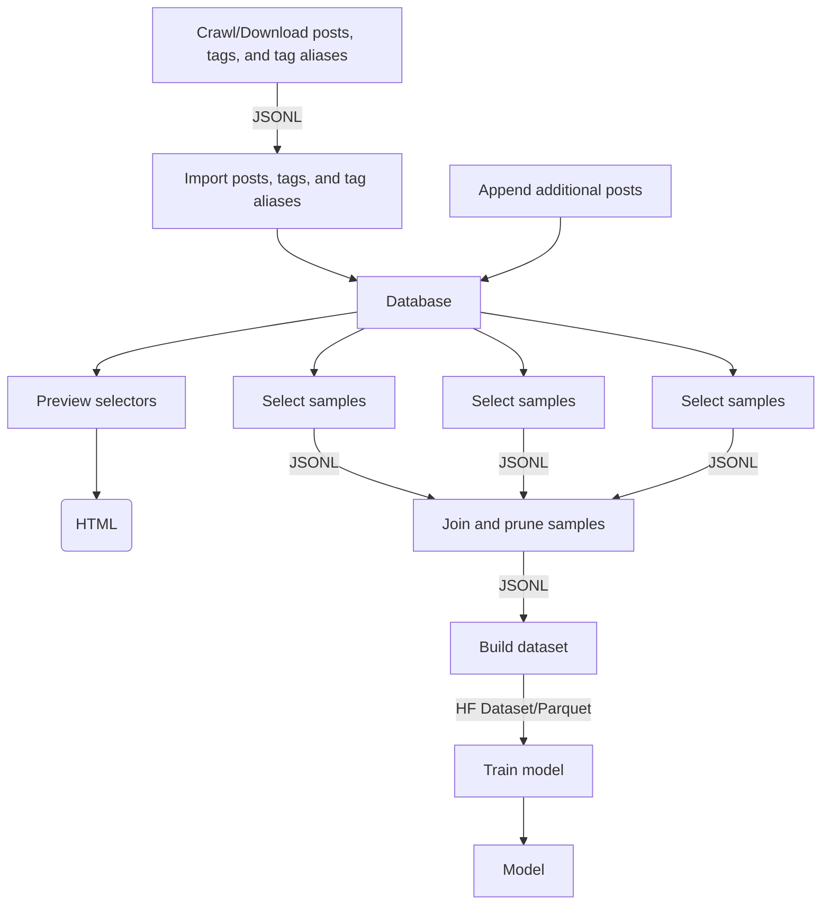

# Dataset Rising

> A toolchain for creating and training Stable Diffusion 1.x, Stable Diffusion 2.x, and Stable Diffusion XL models
> with custom datasets.

With this toolchain, you can:
* **Crawl and download** metadata and images from 'booru' style image boards
* Combine **multiple sources of images** (including your own custom sources)
* **Build datasets** based on your personal preferences and filters
* **Train Stable Diffusion models** with your datasets
* Convert models into [Stable Diffusion WebUI](https://github.com/AUTOMATIC1111/stable-diffusion-webui/tree/master) compatible models
* Use only the parts you need – the toolchain uses modular design, YAML configuration files, and JSONL data exchange formats
* Work with confidence that the end-to-end tooling has been tested with Nvidia's RTX30x0, RTX40x0, A100, and H100 GPUs

## Requirements
* Python `>=3.8`
* Docker `>=22.0.0`

## Tested With
* MacOS 13 (M1)
* Ubuntu 22 (x86_64)


## Full Example
Below is a summary of each step in dataset generation process. For a full production-quality example, see [e621-rising-configs](https://github.com/hearmeneigh/e621-rising-configs) (NSFW).

### 0. Installation
```bash
# install DatasetRising
pip3 install DatasetRising

# start MongoDB database; use `dr-db-down` to stop
dr-db-up
```

### 1. Download Metadata (Posts, Tags, ...)
Dataset Rising has a crawler (`dr-crawl`) to download metadata (=posts and tags) from booru-style image boards.

You must select a unique user agent string for your crawler (`--agent AGENT_STRING`). This string will
be passed to the image board with every  HTTP request. If you don't pick a user agent that uniquely identifies you,
the image boards will likely block your requests. For example:

> `--agent 'my-imageboard-crawler/1.0 (user @my-username-on-the-imageboard)'`

The crawler will automatically manage rate limits and retries. If you want to automatically resume a previous (failed)
crawl, use `--recover`.

```bash
## download tag metadata to /tmp/tags.jsonl
dr-crawl --output /tmp/e962-tags.jsonl --type tags --source e926 --recover --agent '<AGENT_STRING>'

## download posts metadata to /tmp/e926.net-posts.jsonl
dr-crawl --output /tmp/e926.net-posts.jsonl --type posts --source e926 --recover --agent '<AGENT_STRING>'
```

### 2. Import Metadata

> This section requires a running MongoDB database, which you can start with `dr-db-up` command.

Once you have enough post and tag metadata, it's time to import the data into a database.

Dataset Rising uses MongoDB as a store for the post and tag metadata. Use `dr-import` to
import the metadata downloaded in the previous step into MongoDB.

If you want to adjust how the tag metadata is treated during the import,
review files in [`<dataset-rising>/examples/tag_normalizer`](./examples/tag_normalizer) and set the optional
parameters `--prefilter FILE`, `--rewrites FILE`, `--aspect-ratios FILE`, `--category-weights FILE`, and
`--symbols FILE` accordingly.

```bash
dr-import --tags /tmp/e926.net-tags.jsonl --posts /tmp/e926.net-posts.jsonl --source e926
```

### 3. Preview Selectors
> This section requires a running MongoDB database, which you can start with `dr-db-up` command.

After the metadata has been imported into a database, you can use selector files to select
a subset of the posts in a dataset.

Your goal is **not** to include **all** images, but to produce
a set of **high quality** samples. The selectors are the mechanism for that.

Each selector contains a **positive** and **negative** list of tags. A post will be included
by the selector, if it contains at least one tag from the **positive** list and none of the
tags in the **negative** list.

Note that a great dataset will contain positive **and** negative examples. If you only
train your dataset with positive samples, your model will not be able to use negative
prompts well. That's why the examples below include four different types of selectors.

Dataset Rising has example selectors available in [`<dataset-rising>/examples/select`](examples/select).

To make sure your selectors are producing the kind of samples you want, use the `dr-preview`
script:

```bash
# generate a HTML preview of how the selector will perform (note: --aggregate is required):
dr-preview --selector ./examples/select/curated.yaml --output /tmp/curated-previews --limit 1000 --output --aggregate

# generate a HTML preview of how each sub-selector will perform:
dr-preview --selector ./examples/select/positive/artists.yaml --output /tmp/curated-artists
```

### 4. Select Images For a Dataset
> This section requires a running MongoDB database, which you can start with `dr-db-up` command.

When you're confident that the selectors are producing the right kind of samples, it's time to select the posts for
building a dataset. Use `dr-select` to select posts from the database and store them in a JSONL file. 

```bash
cd <dataset-rising>/database

dr-select --selector ./examples/select/curated.yaml --output /tmp/curated.jsonl
dr-select --selector ./examples/select/negative.yaml --output /tmp/negative.jsonl
dr-select --selector ./examples/select/positive.yaml --output /tmp/positive.jsonl
dr-select --selector ./examples/select/uncurated.yaml --output /tmp/uncurated.jsonl
```

### 5. Build a Dataset
After selecting the posts for the dataset, use `dr-join` to combine the selections and 
`dr-build` to download the images and build the actual dataset.

By default, the build script prunes all tags that have fewer than 100 samples. To adjust this limit, use `--min-posts-per-tag LIMIT`.

The build script will also prune all images that have fewer than 10 tags. To adjust this limit, use `--min-tags-per-post LIMIT`.

Adding a percentage at the end of a `--source` tells the build script to pick that many samples of the total dataset from the given source, e.g. `--source ./my.jsonl:50%`.

```bash
dr-join \
  --samples '/tmp/curated.jsonl:30%' \
  --samples '/tmp/positive.jsonl:40%' \
  --samples '/tmp/negative.jsonl:20%' \
  --samples '/tmp/uncurated.jsonl:10%' \
  --output '/tmp/joined.jsonl'

dr-build \
  --source '/tmp/joined.jsonl' \
  --output '/tmp/my-dataset' \
  --upload-to-hf 'username/dataset-name' \
  --upload-to-s3 's3://some-bucket/some/path'
```

### 6. Train a Model
The dataset built by the `dr-build` script is ready to be used for training as is.  Dataset Rising uses
[Huggingface Accelerate](https://huggingface.co/docs/accelerate/index) to train Stable Diffusion models.

To train a model, you will need to pick a base model to start from. The `--base-model` can be any
[Diffusers](https://huggingface.co/docs/diffusers/index) compatible model, such as:

* [hearmeneigh/e621-rising-v3](https://huggingface.co/hearmeneigh/e621-rising-v3) (NSFW)
* [stabilityai/stabilityai/stable-diffusion-xl-base-1.0](https://huggingface.co/stabilityai/stable-diffusion-xl-base-1.0)
* [stabilityai/stable-diffusion-2-1-base](https://huggingface.co/stabilityai/stable-diffusion-2-1-base)
* [runwayml/stable-diffusion-v1-5](https://huggingface.co/runwayml/stable-diffusion-v1-5)

Note that your training results will be improved significantly if you set `--image_width` and `--image_height`
to match the resolution the base model was trained with.

> This example does not scale to multiple GPUs. See the [Advanced Topics](#advanced-topics) section for multi-GPU training.

```bash
dr-train \
  --pretrained-model-name-or-path 'stabilityai/stable-diffusion-xl-base-1.0' \
  --dataset-name 'username/dataset-name' \
  --output '/tmp/dataset-rising-v3-model' \
  --resolution 1024 \
  --maintain-aspect-ratio \
  --reshuffle-tags \
  --tag-separator ' ' \
  --random-flip \
  --train-batch-size 32 \
  --learning-rate 4e-6 \
  --use-ema \
  --max-grad-norm 1 \
  --checkpointing-steps 1000 \
  --lr-scheduler constant \
  --lr-warmup-steps 0
```

### 7. Generate Samples
After training, you can use the `dr-generate` script to verify that the model is working as expected.

```bash
dr-generate \
  --model '/tmp/dataset-rising-v3-model' \
  --output '/tmp/samples' \
  --prompt 'cat playing chess with a horse' \
  --samples 100 \
```

### 8. Use the Model with Stable Diffusion WebUI
In order to use the model with [Stable Diffusion WebUI](https://github.com/AUTOMATIC1111/stable-diffusion-webui), it has to be converted to the `safetensors` format.

```bash
# Stable Diffusion XL models:
dr-convert-sdxl \
  --model_path '/tmp/dataset-rising-v3-model' \
  --checkpoint_path '/tmp/dataset-rising-v3-model.safetensors' \
  --use_safetensors

# Other Stable Diffusion models:
dr-convert-sd \
  --model_path '/tmp/dataset-rising-v3-model' \
  --checkpoint_path '/tmp/dataset-rising-v3-model.safetensors' \
  --use_safetensors
  
# Copy the model to the WebUI models directory:
cp '/tmp/dataset-rising-v3-model.safetensors' '<webui-root>/models/Stable-diffusion'

# Copy the model configuration file to WebUI models directory:
cp '/tmp/dataset-rising-v3-model.yaml' '<webui-root>/models/Stable-diffusion'
```

## Uninstall
The only part of Dataset Rising that requires uninstallation is the MongoDB database. You can uninstall the database
with the following commands:

```bash
# Shut down MongoDB instance
dr-db-down

# Remove MongoDB container and its data -- warning! data loss will occur
dr-db-uninstall
```

## Advanced Topics

### Resetting the Database
To reset the database, run the following commands.

> **Warning: You will lose all data in the database.**

```bash
dr-db-uninstall && dr-db-up && dr-db-create
```

### Importing Posts from Multiple Sources
The `append` script allows you to import posts from additional sources.

Use `import` to import the first source and define the tag namespace, then use `append` to import additional sources.

```bash
# main sources and tags
dr-import ...

# additional sources
dr-append --input /tmp/gelbooru-posts.jsonl --source gelbooru
```

### Multi-GPU Training
Multi-GPU training can be carried out with [Huggingface Accelerate](https://huggingface.co/docs/accelerate/package_reference/cli) library.

Before training, run `accelerate config` to set up your Multi-GPU environment.

```bash
cd <dataset-rising>/train

# set up environment
accelerate config

# run training
accelerate launch \
  --multi_gpu \
  --mixed_precision=${PRECISION} \
  dr_train.py \
    --pretrained-model-name-or-path 'stabilityai/stable-diffusion-xl-base-1.0' \
    --dataset-name 'username/dataset-name' \
    --resolution 1024 \
    --maintain-aspect-ratio \
    --reshuffle-tags \
    --tag-separator ' ' \
    --random-flip \
    --train-batch-size 32 \
    --learning-rate 4e-6 \
    --use-ema \
    --max-grad-norm 1 \
    --checkpointing-steps 1000 \
    --lr-scheduler constant \
    --lr-warmup-steps 0
```

## Setting Up a Training Machine
* Install `dataset-rising`
* Install [Huggingface CLI](https://huggingface.co/docs/huggingface_hub/installation)
* Install [Accelerate CLI](https://huggingface.co/docs/accelerate/basic_tutorials/install)
* Configure Huggingface CLI (`huggingface-cli login`)
* Configure Accelerate CLI (`accelerate config`)

### Optional
* Install [AWS CLI](https://docs.aws.amazon.com/cli/latest/userguide/getting-started-install.html)
* Install [xFormers](https://github.com/facebookresearch/xformers)
* Configure AWS CLI (`aws configure`)

### Troubleshooting

#### NCCL Errors
Some configurations will require `NCCL_P2P_DISABLE=1` and/or `NCCL_IB_DISABLE=1` environment variables to be set.

```bash
export NCCL_P2P_DISABLE=1
export NCCL_IB_DISABLE=1

dr-train ...
```

### Cache Directories
Use `HF_DATASETS_CACHE` and `HF_MODULES_CACHE` to control where Huggingface stores its cache files

```bash
export HF_DATASETS_CACHE=/workspace/cache/huggingface/datasets
export HF_MODULES_CACHE=/workspace/cache/huggingface/modules

dr-train ...
```


## Developers
### Setting Up
Creates a virtual environment, installs packages, and sets up a MongoDB database on Docker. 

```bash
cd <dataset-rising>
./up.sh
```

### Shutting Down
Stops the MongoDB database container. The database can be restarted by running `./up.sh` again.

```bash
cd <dataset-rising>
./down.sh
```


### Uninstall
Warning: This step **removes** the MongoDB database container and all data stored on it.

```bash
cd <dataset-rising>
./uninstall.sh
```

### Deployments
```bash
python3 -m pip install --upgrade build twine
python3 -m build 
python3 -m twine upload dist/*
```

### Architecture


## Links
* [SDXL training notes](https://rentry.org/59xed3#sdxl)
